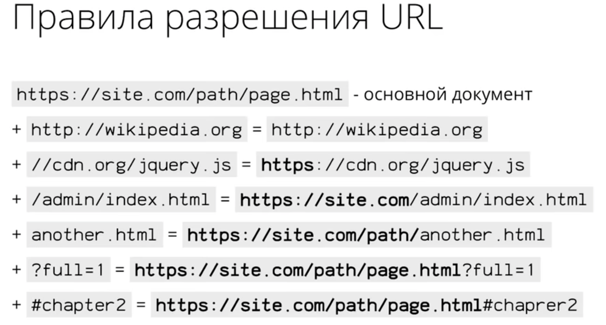

<p id="intro">Привет, ридер 👋.</p>
Мои студенты на крусах часто путаются в том как работают ссылки, поэтому я решил написать
небольшую шпаргалку.


<h2 id="url">URL</h2>

URL - это строка, которая обозначает адрес документа/файла в интернете.

```
https://github.com/Shramkoweb/blog/blob/master/src/style.css
```
- **https** - scheme часть, протокол по которому браузер понимает как загружать документ.
- **github.com** - доменное имя сервера, здесь еще может быть порт. Например, github.com**:80**
- **/Shramkoweb/blog/blob/master/src/style.css** - путь к файлу
- **?key1=value1&key2=value2** - параметры (опционально)
- **#anchor** - якорь(положение) на странице (опционально)

## Абсолютные ссылки

Абсолютная ссылка — это адрес к файлу или странице целиком, со всеми вышеописанными частями [URL](#url). 
По такой ссылке не зависимо от того, где находится эта ссылка я смогу попасть на нужный ресурс.

Пример:

```
https://developer.mozilla.org/en-US/docs/Learn
```

Можно не указывать протокол (http/https), тогда браузер автоматически будет использовать протокол на котором был
загружен сайт.

```
//developer.mozilla.org/en-US/docs/Learn
```

## Относительные ссылки

Эти ссылки всегда будут привязаны к тому месту, где они находятся.
Например, мы сейчас находимся на странице:

https://shramko.xyz/absolute-and-relative-links

- **Относительный путь без указания домена** (данный тип ссылок на 
  [MDN](https://developer.mozilla.org/en-US/docs/Learn/Common_questions/What_is_a_URL#examples_of_absolute_urls) считается абсолютным), однако он является относительным 
  так как всегда будет создавать ссылку относительно домена, на котором находится. 
  Такой тип ссылок еще называют _ссылка относительно корня сайта_.


```js
/another/index.html

Превратиться - https://shramko.xyz/another/index.html
```


- **Относительный путь от текущего документа**

```js
pictures/cow.jpg

Превратиться - https://shramko.xyz/absolute-and-relative-links/pictures/cow.jpg
```

- **Относительный путь с выходом на один уровень выше**

```js
../style.css

1. .. вышли на уровен выше 
https://shramko.xyz/absolute-and-relative-links -> https://shramko.xyz/

2. /style.css добавили относитльный путь к файлу https://shramko.xyz/style.css
```

## Якоря (ссылки по ID)

Якорные ссылки обычно используют для навигации по текущей странице. Например, ссылка на какой-то абзац или заголовок.

```html
Добавим атрибут id для якоря

<p id="intro">Привет, ридер 👋.</p>
```

```html
В ссылке атрибут href будет содержать ID якоря
<a href="#intro">Вернуться в начало страницы</a>
```

Например, [эта ссылка якорь](#intro) вернет вас к параграфу приветствия.

Так же можно ссылаться на якорь другой/внешней страницы.

```html
Якорь на странице loio.com блок features

<a href="https://loio.com/#features">Features</a>
```




### Полезные ссылки

- [What is a URL?](https://developer.mozilla.org/en-US/docs/Learn/Common_questions/What_is_a_URL)
- [How DNS works](https://howdns.works/)


