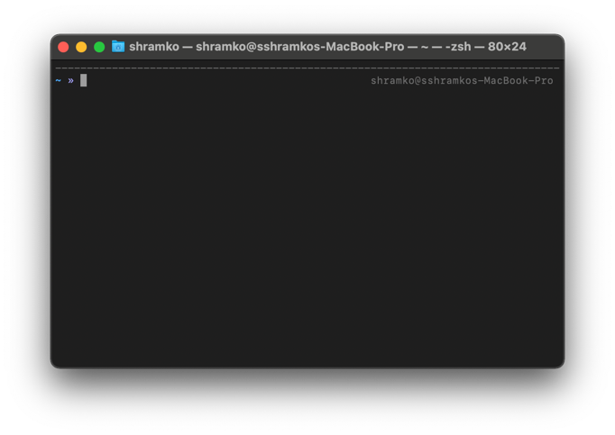

## Почему до сих пор используют командную строку

1. Не на всех компьютера есть визуальная оболочка <abbr title="graphical user interface">GUI</abbr>.
Например, почти на всех серверах нет привычной нам визуальной оболочки и мышку там будет невозможно использовать.
2. **Скорость** - выполнять одиночные команды или несколько намного быстрее в командной строке, так как не нужно переключаться
между экранами, ждать выпадающие окна и так далее.
3. **Автоматизация** - тут нет равных. Выполнить одну команду за другой и вывод первой использовать как аргумент последующей? Легко.
Нужно дождаться запуска сервера и только потом запускать клиентское приложение? Тоже можно.
Без командной строки эти процессы били бы рутинными и занимали очень много времени.
 
## Базовые команды для ежедневной работы

- **cd** - сменить директорию(папку)
```shell
cd .. // выйти на уровень выше текущей директории
cd some_dir // зайти в папку some_dir если она есть в текущей директории
```

- **ls** показать список файлов

```shell
ls  // показать список файлов
ls -a // показать все скрытые файлы и директории
```

- **pwd** - вывести на экран текущую рабочую директорию (где вы находитесь сейчас)
- **mkdir** - создать папку

```shell
mkdir "dirname"  // создать директорию с именем dirname
```

- **rmdir** - удалить директорию

```shell
rmdir "dirname"  // удалить директорию с именем dirname
```

- **cat** - вывести на экран содержимое файла
- **man** - вывести на экран помощь по выбранной команде 

```shell
man ls  // выведет на экран помошь по команде ls
```
- **rm** - удалить файл
- **echo** - вывести на экран переданный input 


## Полезности

- [The Linux Command Handbook](https://www.freecodecamp.org/news/the-linux-commands-handbook/ "The Linux Command Handbook")
- [Для чего консоль бэкенд-разработчику](https://htmlacademy.ru/blog/boost/tools/backend-console "Для чего консоль бэкенд-разработчику")
- [Установка терминала на Windows](https://htmlacademy.ru/blog/boost/tools/installing-the-console-on-windows "Установка терминала на Windows")


