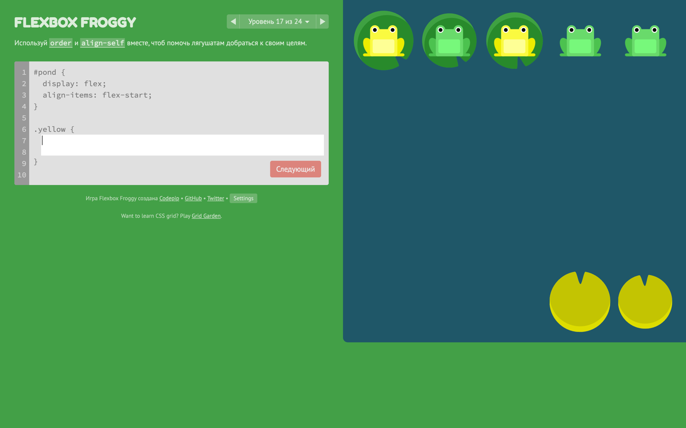
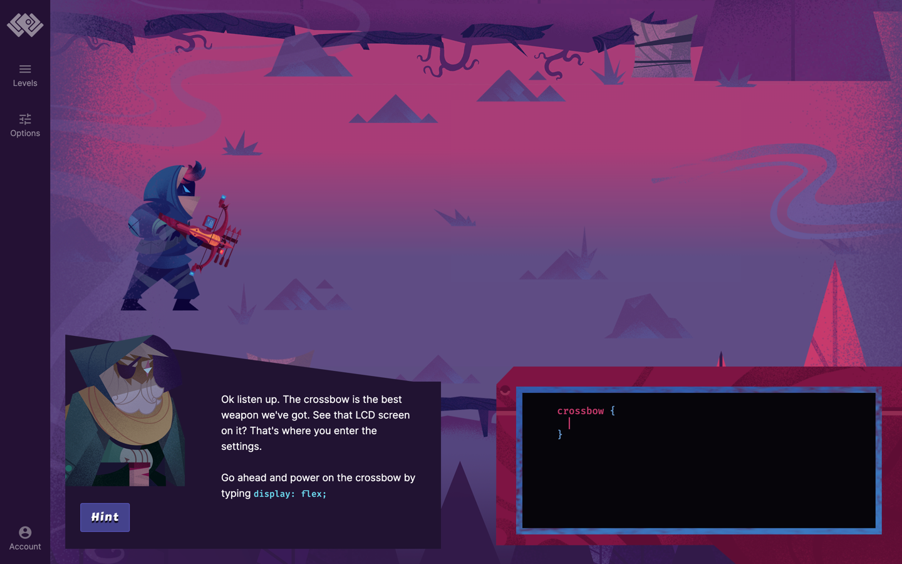
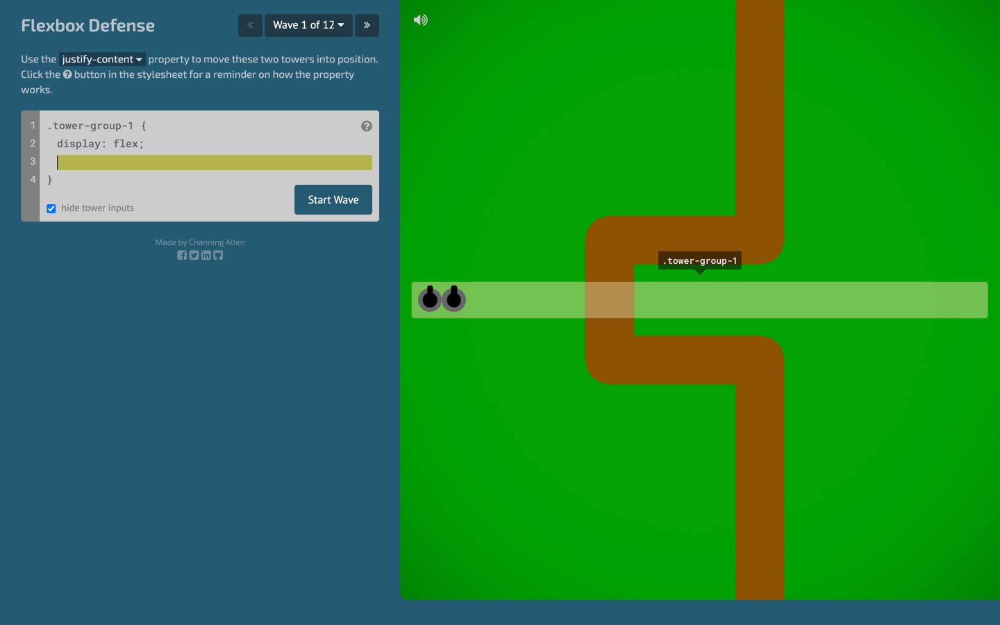
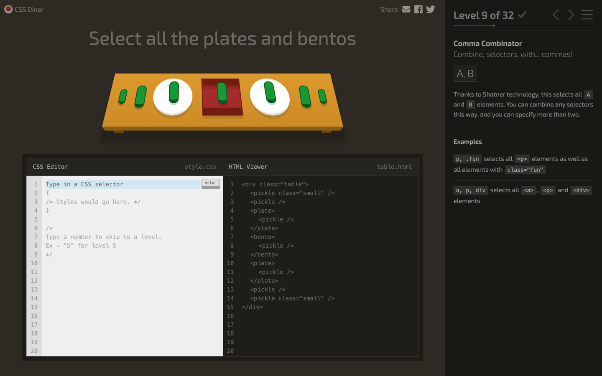
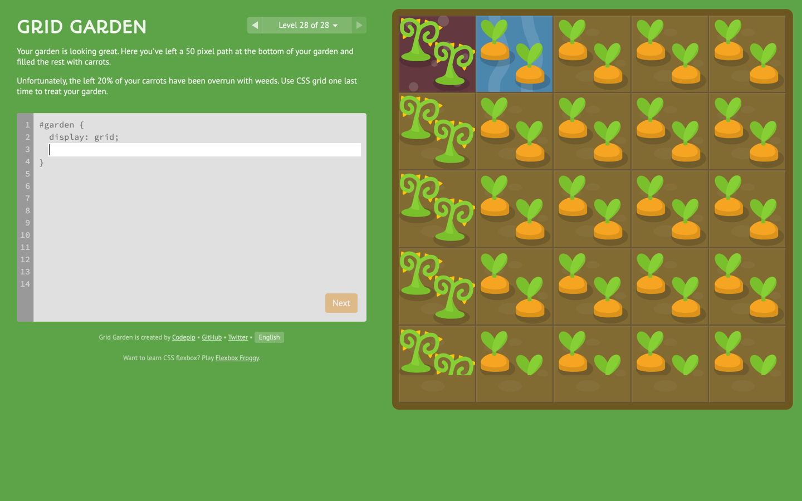
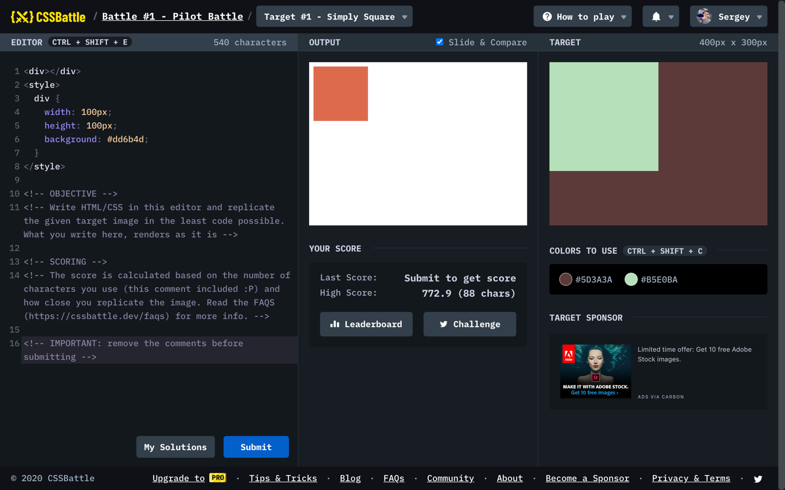

#### Flexbox frog

Игра, в которой тебе нужно помочь лягушонку справиться с трудностями на его пути с помощью написания CSS.
Очень полезно будет тем, кто только изучает CSS & Flexbox.

https://flexboxfroggy.com/

#### Flexbox Zombies

Самая красочная и захватывающая игра. В ней есть все.

Диалоги, музыка, анимации и все это в браузере 🤯.

https://mastery.games/flexboxzombies/

#### Flexbox Defense

Аналог жабок, только про войну 🪖 и в жанре tower defence.
Из приятных отличий, текстовое описание в удобном виде выученных свойств flexbox.

http://www.flexboxdefense.com/

#### CSS Diner

Из опыта наставничества, CSS селекторы 🎯 — одна из самых сложных тем.
Эта игра как раз про них. Стоит пройти несколько раз!

https://flukeout.github.io/

#### Grid garden

Вырастить на огороде морковку и выучить CSS Grid? Легко 🥳
Известная игра от автора Flexbox froggy.

https://cssgridgarden.com/

#### CSS Battle 🏆

В финале, когда ты стал мастером CSS можно сразится с лучшими.
Суть сражения, добиться 100% сходства исходного экрана и итогового, при минимальном количестве кода (CSS/HTML).

В этом сражение участвуют известные личности в мире web разработки.

- [Vincent De Oliveira](https://iamvdo.me/)
- [Ilya Streltsyn](https://css-live.ru/)

https://cssbattle.dev/

#### Полезности
- [Сайт с обучающими играми о программировании](https://codepip.com/games/)
