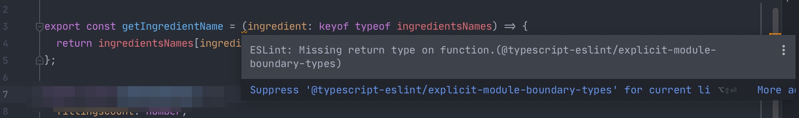
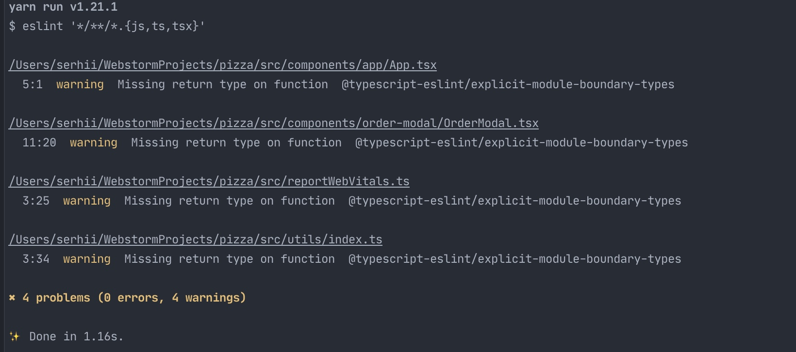
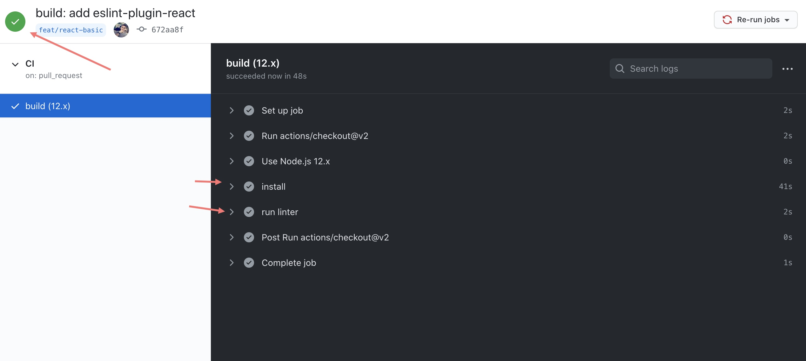

#### Установка и настройка ESLint для TypeScript

Установим нужные нам зависимости 
    
    yarn add -D eslint eslint-plugin-react @typescript-eslint/parser @typescript-eslint/eslint-plugin
    
- **eslint**: сам eslint
- **eslint-plugin-react** - плагин с правилами для React
- **@typescript-eslint/parser** - парсер, который дает возможность проводить линтинг TS файлов
- **@typescript-eslint/eslint-plugin** - плагин с предустановленными правилами линтинга

Далее добавим конфигурационный файл `.eslintrc.json` в корень проекта.

Вставим в него базовый конфиг:

```json
{
  "parser": "@typescript-eslint/parser", // Парсер который мы ставили ранее
  "parserOptions": {
    "ecmaVersion": 2018, // Версия экмаскрипта которую вы хотите уметь парсить
    "sourceType": "module", // Можно ли использовать imports
    "ecmaFeatures": {
      "jsx": true // Нужно ли парсить jsx
    }
  },
  "extends": [
    "plugin:react/recommended", // Применяем правила с плагинов
    "plugin:@typescript-eslint/recommended" 
  ],
  "env": {
    "browser": true // окружение в котором работает ваше приложение
  },
  "rules": {
    "react/prop-types": 0 // дополнительные правила, которые вы хотите сами настроить
  }
}
```

#### Запускаем проверку

Здесь есть два варианта.

##### IDE
Если у вас установлен плагин eslint в IDE, то он автоматически будет подсвечивать
ошибки/предупреждения в реальном времени: 

##### Console
Запускаем через консоль. В файле `package.json` внутри секции `scripts` добавим:
```json
"lint": "eslint '*/**/*.{js,ts,tsx}'"
```

Запускаем: 

    yarn lint

В результате увидим ошибки и предупреждения такого вида: 

#### Запустим наш линтинг внутри GitHub Actions

1. Создаем файл внутри вашего репозитория по такому пути **ваш-репозиторий**/.github/workflows/**любое-имя-файла**.yml
2. Пример нашего файла для линтинга:
```yaml
name: CI # Имя задачи которое будет видно в GitHub
on:
  pull_request: # На какие действия будет срабатывать наш CI, в примере у нас пулл реквест
    branches: [ master ]  # Ветки на которые он будет срабатывать по условию выше
jobs:
  build:
    runs-on: ubuntu-latest # На какой ОС запускать проверки
    strategy:
      matrix:
        node-version: [12.x] # Версия необходимой NodeJS
    steps:
      - uses: actions/checkout@v2
      - name: Use Node.js ${{ matrix.node-version }}
        uses: actions/setup-node@v1
        with:
          node-version: ${{ matrix.node-version }}
      - name: install # Имя шага
        run: yarn install # Что делаем на этом шаге. Устанавливаем зависимости 
      - name: run linter
        run: yarn lint # Запускаем скрипт lint который мы добавили в `package.json`
```

Теперь наша проверка линтером запускается на гитхабе, что очень удобно и шанс пропустить код с ошибками уменьшается.



#### Полезности
- [Держи свой код чистым с помощью ESLint](https://frontend-stuff.com/blog/eslint/)
- [Create-React-App with TypeScript, ESLint, Prettier, and Github Actions](https://medium.com/@brygrill/create-react-app-with-typescript-eslint-prettier-and-github-actions-f3ce6a571c97)
- [Quickstart for GitHub Actions](https://docs.github.com/en/free-pro-team@latest/actions/quickstart)
- [What is ESLint?](https://hackernoon.com/what-is-eslint-how-do-i-set-it-up-on-atom-70f270f57296)

