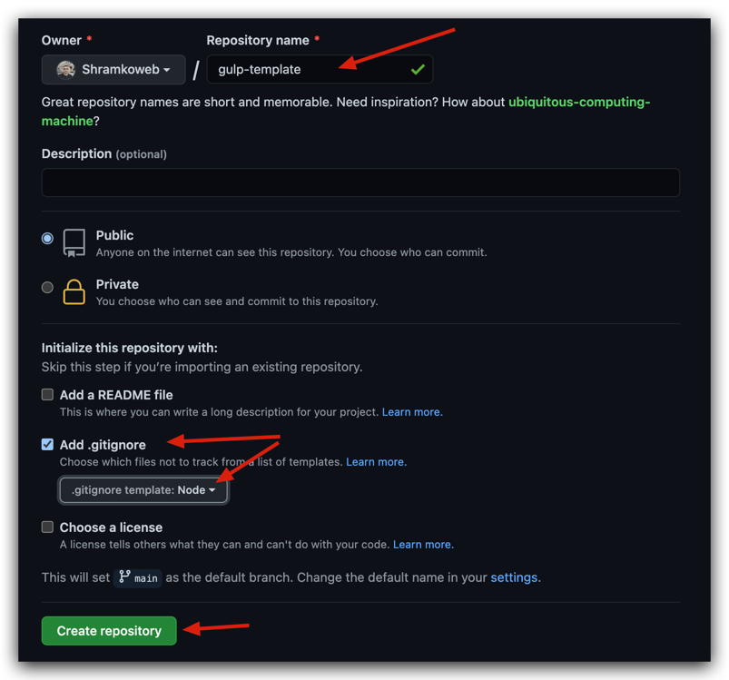

#### Создаем репозиторий

Переходим на GitHub - [страницу создания репозиториев](https://github.com/new) и вводим имя нового репозиторий - **gulp-template** (например)



Клонируем локально созданный репозиторий по протоколу <abbr title="Cетевой протокол прикладного уровня">SSH</abbr>.<br/>
[Моя статья](/ssh-setup/) как создать <abbr title="Cетевой протокол прикладного уровня">SSH</abbr> ключи если их у вас нет.
```shell
git clone git@github.com:Shramkoweb/gulp-template.git
# gulp-template - имя вашего репозитория
```

#### Создаем проект

Запускаем команду инициализации **npm init** в корне проекта.

```shell
# Инициализация проекта
# init – означает initialization
$ npm init
```
Отвечаем на вопросы <abbr title="Менеджер пакетов, входящий в состав Node.js">npm</abbr>.<br/>
Как должен называться проект, какая у него должна быть версия, описание и тому подобное.
Все эти вопросы можно смело пропускать, у вас всегда будет возможность поменять ответы

На выходе получим файл **package.json** вроде этого:

```json
{
  "name": "gulp-template",
  "version": "1.0.0",
  "description": "gulp template for sass/html and JS",
  "main": "index.js",
  "scripts": {
    "test": "echo \"Error: no test specified\" && exit 1"
  },
  "repository": {
    "type": "git",
    "url": "git+https://github.com/Shramkoweb/gulp-template.git"
  },
  "keywords": [
    "gulp",
    "js",
    "html",
    "css",
    "sass"
  ],
  "author": "Serhii Shramko <shramko.web@yahoo.com>",
  "license": "ISC",
  "bugs": {
    "url": "https://github.com/Shramkoweb/gulp-template/issues"
  },
  "homepage": "https://github.com/Shramkoweb/gulp-template#readme"
}
```

#### Зависимости проекта

#### devDependencies vs dependencies

**dependencies** - зависимости вашего проекта, которые нужны для запуска и работы в реальном времени
вашего приложения. Например на сайте это может быть [слайдер](https://kenwheeler.github.io/slick/) который нужен во время работы самого сайта.<br/>
Такие зависимости ставим через команду:
```shell
npm i slick-carousel или npm i -E slick-carousel 
# флаг -Е зафиксирует версию вашего слайдера, желательно тал делать всегда
```

**devDependencies** - зависимости которые вам нужны для разработки сайта, но сам сайт без них спокойно работает. <br/>
Например **Gulp** - таскранер, который мы разберем в следующем посте.
Он нам нужен только на этапе сборки нашего проекта, когда же проект собран и работает нам собирать уже ничего не нужно, 
поэтому сам **Gulp** мы будем ставить в **devDependencies**.

```shell
npm i -D gulp или npm i -DE gulp
# Флаг -D говорит, что зависимость стоит ставить в devDependencies
# Флаги можно комбинировать, например -DE равнозначно отдельным флагам -D и -E
```

В [документации npm](https://docs.npmjs.com/cli/v7/commands/npm-install) - можно почитать про флаги и как это работает более подробно.

#### Версии пакетов

Зачем нав версии и почему мы так переживаем о них?

Предположим, что вы работаете с другом Васей над одним проектом.

Вася установил в проект библиотеку [Lodash](https://lodash.com/).
Эта библиотека нужна во время работы проекта, поэтому ставим ее в dependencies.</br>
Но Вася забыл добавить флаг `-E`
```shell
npm i lodash
```

Через неделю когда Вася везде в проекте будет использовать Lodash, появится более новая версия чем у Васи.
И вы во время установки `npm i` зависимостей этого проекта, установите себе не такую же версию как у Васи, а новую.
В новой версии может поменяться синтаксис или еще что-то, и код Васи у вас перестанет работать или будут ошибки.
Поэтому версии всегда стоит фиксировать.

Про версионирование классно описано тут [Семантическое Версионирование](https://semver.org/lang/ru/)


#### To be continued ... 
В следующем посте напишем собственный gulp файл и настроим сборку **SCSS** файлов и верстки из исходников