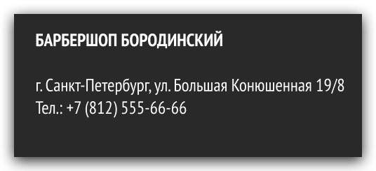
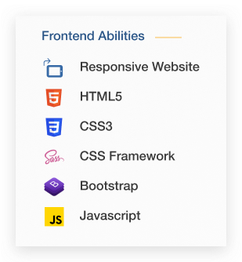
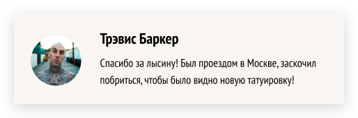
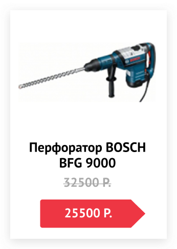
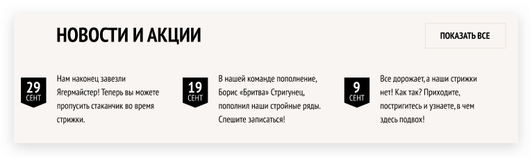
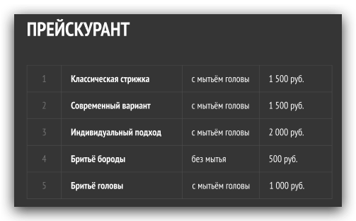
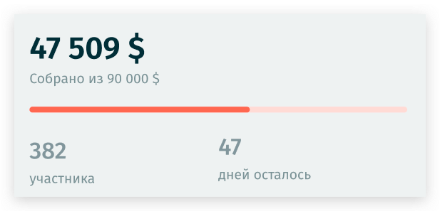

## address

Полезная вещь, чтобы обернуть адрес, где находится офис вашей фирмы,
Например, вот так можно было бы заверстать, такой блок.
---



```html
<div>
  <p>Барбершоп Бородинский</p>
  <address>г. Санкт-Петербург, ул. Большая Конюшенная 19/8</address>
  <a href="tel:+78125556666">Тел.: +7 (812) 555-66-66</a>
</div>
```

## hgroup

Часто в портфолио пишут имя и фамилию, а под ней позицию на которой работают.
Как по мне, это отличный вариант объединить в группу заголовков.
---


```html
<hgroup>
  <h1>Kristin Watson</h1>
  <h2>Junior UI/UX designer</h2>
</hgroup>
```

## dl & dt & dd

Почти все сайты имеют список преимуществ над своими конкурентами.
Структура зачастую такая: преимущество(**dt**) и его описание(**dd**).
Как раз этот список и можно сделать более семантично.

---


```html
<dl>
  <dt>The best products start with Sketch</dt>
  <dd>
    Slate helps you see how many
    more days you need to work to
    reach your financial goal.
  </dd>
  
  <dt>Fastest way to organize</dt>
  <dd>
    Slate helps you see how many
    more days you need to work to
    reach your financial goal.
  </dd>
  
  <dt>Work better together</dt>
  <dt>
    Slate helps you see how many
    more days you need to work to
    reach your financial goal.
  </dt>
</dl>
```

## abbr

Используешь на своей сайте аббревиатуры или акронимы? Оберни это в <abbr> и добавь
полное описание с помощью атрибута title.

---



```html
<abbr title="Cascading Style Sheets">CSS</abbr>
<abbr title="Hypertext Markup Language">HTML</abbr>
```

## blockquote

У **blockquote** есть полезный атрибут **cite** - в который можно вставить ссылку, на конкретный отзыв где-то в интернете.

---



```html
<blockquote cite="https://some-url">
  
  <cite>Трэвис Баркер</cite>
  <p>
    Спасибо за лысину! Был проездом в Москве, заскочил побриться,
    чтобы было видно новую татуировку
  </p>
</blockquote>
```

## kbd

Если вы пишете приложение, то часто в нем могут быть всякие сочетания горячих клавиш.

---

```html
<kbd>Ctrl</kbd>
<kbd>Shift</kbd>
<kbd>Command</kbd>
```

## s

На сайте акция и старая цена больше не актуальна? На помощь приходит s тег.
Зачеркивает текст и по семантике говорит, что текст устарел.
---

Есть еще очень похожие:

- del - удаленная часть текста [MDN](https://developer.mozilla.org/en-US/docs/Web/HTML/Element/del)
- ins - новый вставленный текст [MDN](https://developer.mozilla.org/en-US/docs/Web/HTML/Element/ins)



```html
<article>
  
  <h1>Перфоратор BOSCH BFG 9000</h1>
  <s>32500 Р.</s> // Старая цена
  <span>25500 Р.</span> // Новая и актуальная цена
</article>
```

## time

Каждая новость обычно относится к какой-то дате.
Пригодится **time**, только не забудь атрибут **datetime** который укажет, для браузера точную дату

---



```html
<div>
  <time datetime="2021-09-29">29 сентября</time>
  <p>
    Нам наконец завезли
    Ягермайстер! Теперь вы можете
    пропусить стаканчик во время
    стрижки.
  </p>
</div>
```


## Любимые таблички ❤️

Их не любят из-за сложностей стилизации, но они очень часты на сайтах в блоках цены, расписания, сравнения тарифов или
конкурентов.

**tr** - Рядок таблицы

**th** - Ячейка заголовок данного рядка

**td** - Просто ячейка

**caption** - Описание таблицы


---



```html
<table>
  <caption>ПРЕЙСКУРАНТ</caption>
  <tr>
    <th>1</th>
    <td>Классическая стрижка</td>
    <td>с мытьём головы</td>
    <td>1 500 руб.</td>
  </tr>
  
  <tr>
    <th>2</th>
    <td>Современный вариант</td>
    <td>с мытьём головы</td>
    <td>1 500 руб.</td>
  </tr>
  
  <tr>
    <th>3</th>
    <td>Индивидуальный подход</td>
    <td>с мытьём головы</td>
    <td>2000 руб.</td>
  </tr>
</table>
```


## progress
 
Просто прогресс бар 🧑‍💻

---



```html
<div>
  <span>47 509 $</span>
  <p>Собрано из 90 000 $</p>
  
  <progress max="100" value="60">60%</progress>
  <div>
    <p>382 участника</p>
    <p>47 дней осталось</p>
  </div>
</div>
```

> Спасибо [HTML Academy](https://htmlacademy.ru) и [Figma community](https://www.figma.com/community) за их макеты, с которых делал скриншоты.

#### Полезности
- [Перечень тегов на MDN](https://developer.mozilla.org/en-US/docs/Web/HTML/Element)
- [html5doctor список и обьяснение тегов](http://html5doctor.com/element-index/)
