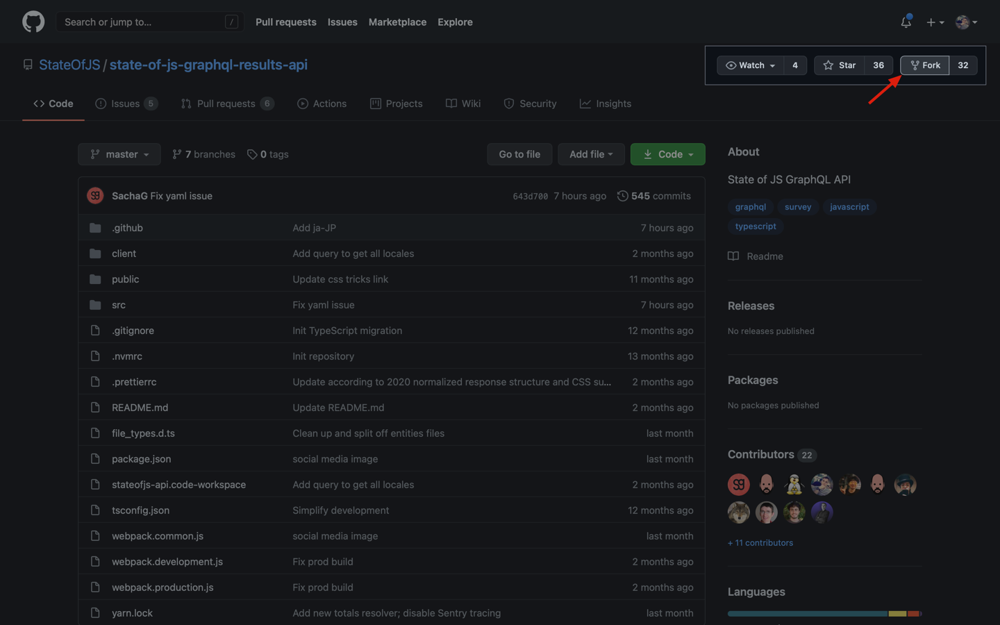
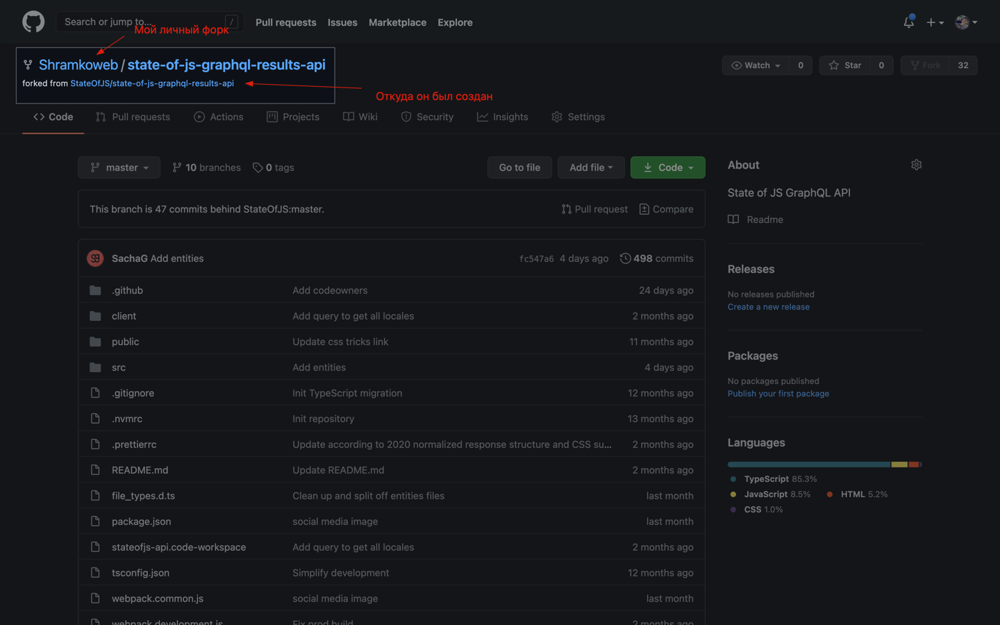
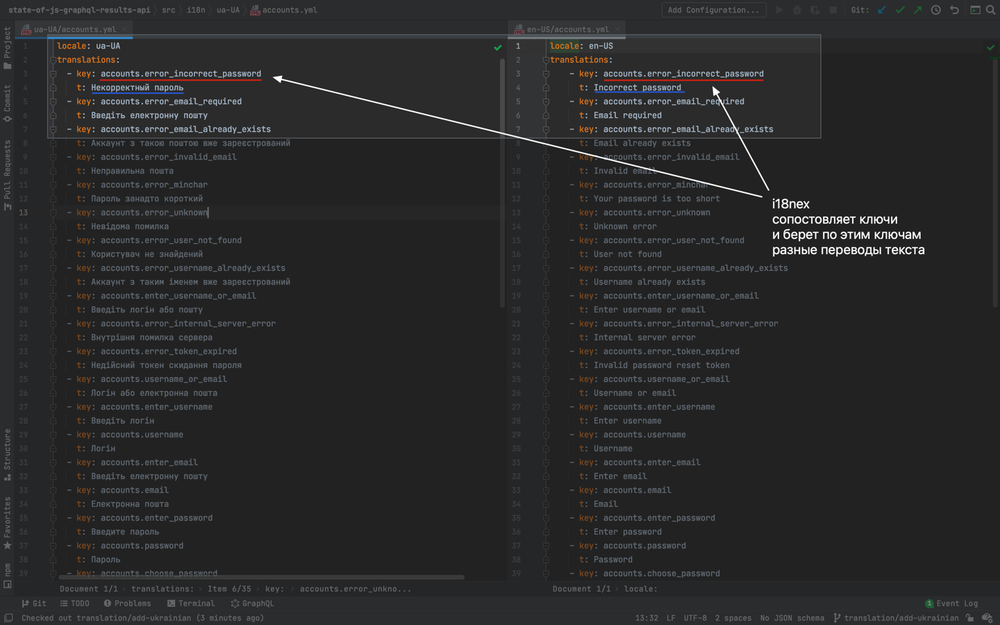

Сегодня поговорим о моем опыте перевода
<a href="https://survey.stateofjs.com/survey/state-of-js/2020" target="_blank">State of JS</a>
и
<a href="https://survey.stateofjs.com/survey/state-of-css/2020" target="_blank">State of CSS</a>
на украинский язык.

#### Как начать что-то пушить в Open Source?

Обычно у вас нет доступа к репозиториям в которых лежит код, поэтому для начала сделаем форк <a href="https://docs.github.com/en/free-pro-team@latest/github/getting-started-with-github/fork-a-repo" target="_blank">fork</a>.

После нажатия и создания форка, github перекинет вас на личную копию (форк) репозитория.

Готово. Начинаем работать 💪.

#### Ветки и Gitflow

В разработке принято на любую задачу — создавать отдельную ветку. Этот подход называют [Gitflow](https://www.atlassian.com/git/tutorials/comparing-workflows/gitflow-workflow).

Например я создал ветку **translation/add-ukrainian** в которой и буду добавлять перевод на украинский.

Создаю отдельную папку для украинского языка по аналогии с остальными `src/i18n/ua-UA`.

**src** - папка в которой лежат все исходные файлы для разработки сайта.

**[i18n](https://www.i18next.com/)** - частая, аббревиатура для именования
чего-то связанного с интернационализацией и переводами/локалями.

**ua-UA** - здесь будут лежать все текста в *YAML* формате.

#### YAML, i18next что это и как работает?

**YAML** - как и JSON, в целом это формат для хранения удобно читаемых сериализованных данных.

**i18next** - берет с yaml файла ключ и просто в месте вызова подставляет текст лежащий по этому ключу.

В итоге вся задача по переводу больших сайтов сводится написанию таких yaml/json файлов и наполнению их текстами.
Это очень удобно.

Финальный [Pull Request](https://github.com/StateOfJS/state-of-js-graphql-results-api/pull/102) 🥳.

#### Зачем тратить время на все это?

Я всегда ищу что-то полезное во всех задачах которые делаю.

Например тут я разобрался немного больше с YAML и i18next.
Попрактиковался в английском, так как он у меня слабенький 😭.
Получена лычка и активность в Open Source сообществе.

#### Полезности

- [YAML - JSON parser](http://nodeca.github.io/js-yaml/)
- [Официальный сайт YAML](https://yaml.org/)
- [Опросы которые мы тут с вами переводили](https://survey.stateofjs.com/)
- [Понять Open Source](https://habr.com/ru/post/267473/)
