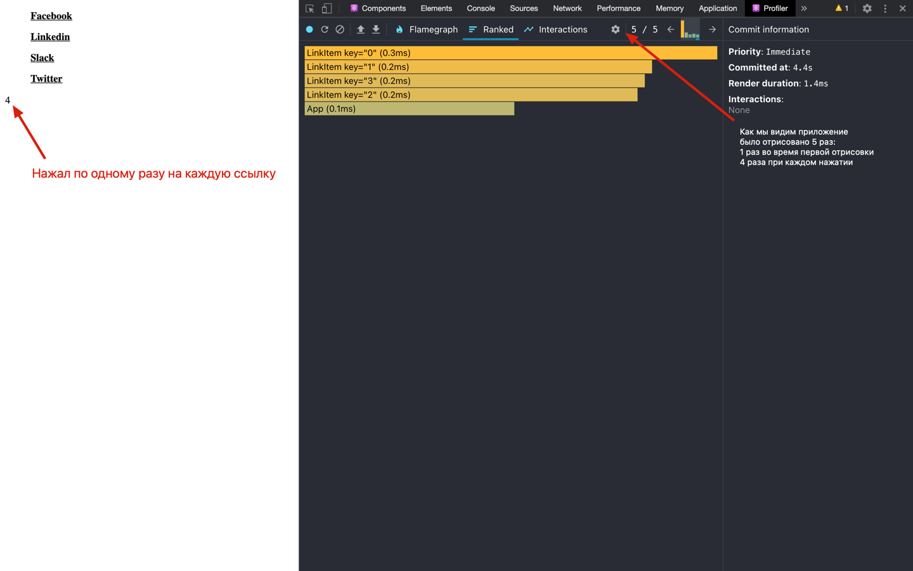
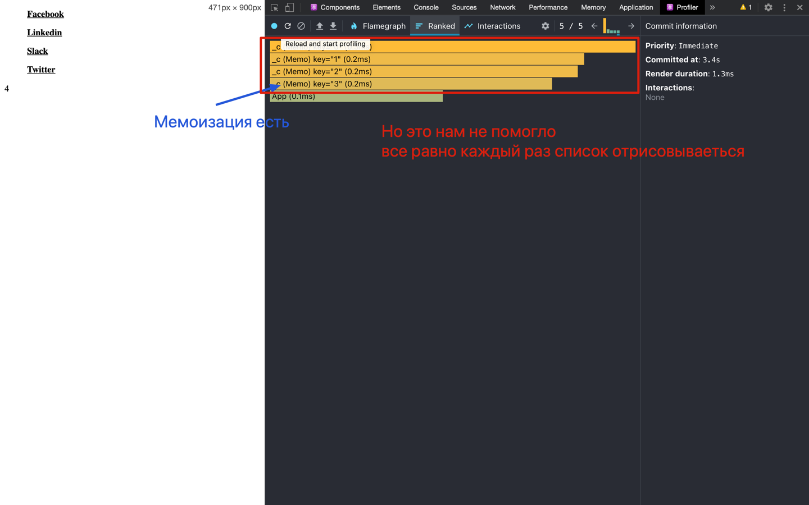
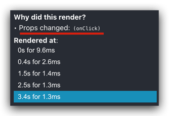
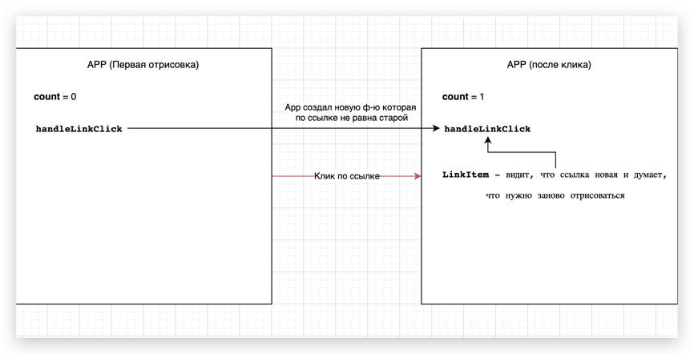
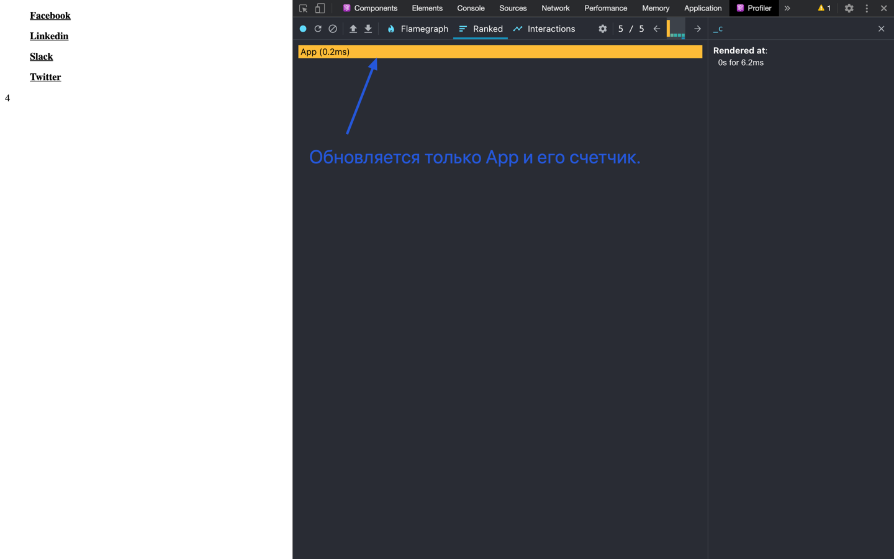

Часто на сайте есть блок ссылок на ваши социальные сети.


И мы хотим считать сколько раз в сумме нажали на наши социальные сети. Например для этого используют
**GTM** (Google Tag Manager).

#### Пример

```jsx
const links = [
  {
    id: "0",
    href: "#",
    label: "Facebook"
  },
  {
    id: "1",
    href: "#",
    label: "Linkedin"
  },
  {
    id: "2",
    href: "#",
    label: "Slack"
  },
  {
    id: "3",
    href: "#",
    label: "Twitter"
  }
];

const LinkItem = ({ href, label, onClick }) => {
  return (
    <a onClick={onClick} href={href}>
      {label}
    </a>
  );
};

export default function App() {
  const [count, setCount] = React.useState(0);

  const handleLinkClick = () => {
    setCount((prevState) => prevState + 1);
  };

  return (
    <div>
      <ul>
        {links.map((link) => (
          <LinkItem
            key={link.id}
            href={link.href}
            label={link.label}
            onClick={handleLinkClick}
          />
        ))}
      </ul>

      <span>{count}</span>
    </div>
  );
}
```

На выходе небольшое приложение, которое отрисовывает ссылки и считает кол-во нажатий.
Вроде все работает как надо, но давайте попробуем нажать на ссылку...



##### Проблема

Помимо отрисовки обновленного счетчика нажатий, отрисовывается и список ссылок, которые не меняются.


Давайте попробуем убрать лишние отрисовки списка.

Гуглим... 🧐.

Сразу видим выход, обернуть компонент в <a href='https://ru.reactjs.org/docs/react-api.html#reactmemo' target="_blank" rel="noreferrer">**React.memo**</a>

> Если ваш компонент всегда рендерит одно и, то же при неменяющихся пропсах, вы можете обернуть его в вызов React.memo для повышения производительности в некоторых случаях, мемоизируя тем самым результат. Это значит, что React будет использовать результат последнего рендера, избегая повторного рендеринга.

```jsx
const LinkItem = React.memo(({ href, label, onClick }) => {
  return (
    <a onClick={onClick} href={href}>
      {label}
    </a>
  );
});
```

Как видим, нам это не помогло. Компонент мемоизирован, но все равно отрисовывается каждый раз заново.



В чем проблема? Смотрим причину перерисовки.



Что **onClick**? Это же наша функция, которая передаётся в каждый компонент **LinkItem** и увеличивает кол-во нажатий.
Но мы же ее не меняем никак, что происходит?

##### Как React понимает, что стоит обновить?

React делает так называемый **Shallow compare** - поверхностное сравнение.

> shallowCompare поверхностно сравнивает объекты текущих props и state с будущими nextProps и nextState. При переборе ключей сравниваемых объектов возвращается true, если значения ключа в каждом объекте имеют нестрогое равенство.

Наш проблемный **LinkItem** зависит только от **props**, давайте разберем как они выглядят и как их сравнивает React, 
чтобы понять, стоит ли перерисовывать компонент.

**props** - это объект.

```js
{
  href: "#"; // строка
  label: "Facebook"; // строка
  onClick: () => {}; // Функция handleLinkClick которую мы передаем с родительского компонента
}
```

Для примитивных данных типа **string, number, boolean, undefined** и т.д React просто сравнивает их значение с предыдущим.

Для структурных данных **object, function** - он проверяет поменялась ли ссылка на них.

> "function" - это по сути не отдельный тип данных в JS, а просто объект. Но typeof вернет "function" 😃

Наша проблема как раз кроется в последнем. Давайте по шагам объясню что делает React когда мы кликаем на ссылку
и увеличиваем наш счетчик нажатий:

1. Срабатывает props **onClick** в **LinkItem**, который в свою очередь является ссылкой на **handleLinkClick** в **App**. 
   handleLinkClick увеличивает стейт **count** и App перерисовывается, так как ему нужно отрисовать новое значение count.
   
2. Отрисовываются все **LinkItem** из-за изменений **onClick** пропса, хотя мы используем React.memo. 

3. Отрисовывается новое значение **count** (счетчик) так как поменялся стейт **App**.

Проблема в пункте 2. Пропсы **href** и **label** это простые строки, и React.memo видит, что они не 
поменялись. Однако он спотыкается на проверке **onClick**.

Дело в том, что когда происходит пункт 3. React полностью пересоздает тело ф-и **App**. И таким образом при каждом изменении
стейта у нас **создается новая** ф-я **handleLinkClick**. Она же по **ссылке** сравнивается внутри React.memo(LinkItem) 
и тот видит, **что это новая ссылка, на новую ф-ю** и делает нежелательный рендер списка.



#### Фиксим

Нам нужно сказать реакту, что ф-ю **handleLinkClick** нужно создать один раз. И при перерисовках **App** не создавать ее заново.

Для этого используем <a href='https://ru.reactjs.org/docs/hooks-reference.html#usecallback' target="_blank" rel="noreferrer">**React.useCallback**</a>

```js
 const handleLinkClick = React.useCallback(() => {
    setCount((prevState) => prevState + 1);
  }, []); // пустой массив зависимостей вторым параметром, так как мы хотим создать ф-ю 1 раз и не пересоздавать ее больше
```

Приложение работает как надо и не делает лишние отрисовки. 🏆



##### Полезности
- [Ссылка на код в песочнице](https://codesandbox.io/s/reactmemo-usecallback-48eeu)
- [How to use React memo](https://www.robinwieruch.de/react-memo)
- [React Performance Optimization Tips](https://dev.to/harshdand/react-performance-optimization-tips-4238)
