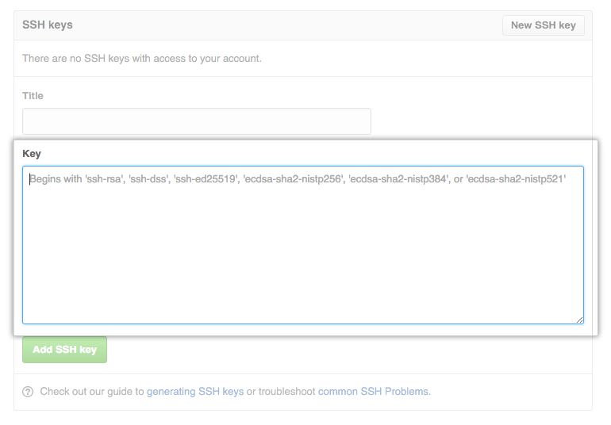

> Если вы используете GitHub без SSH ключей, то вы тратите много времени на постоянный ввод логина и пароля при каждом
> пуше коммита. Ключи помогают опознать ваш компьютер и не тратить время на рутину.

#### Проверим наличие ключей

Для начала проверим, нет ли ключей на данном компьютере.
Открываем терминал и вводим команду:

    ls -al ~/.ssh
    
    # Покажет перечень файлов в .ssh папке, если они есть

Если ключи есть, то мы увидим сообщение:

    -rw-------   1 serhii  staff  3389 Nov 23  2019 id_rsa
    -rw-r--r--@  1 serhii  staff   747 Nov 23  2019 id_rsa.pub
    -rw-r--r--   1 serhii  staff  5936 Aug 25 14:52 known_hosts

В таком случае можно перейти к разделу -- **Добавляем ключи в ssh-agent**

Если ключей нет, то вы получите сообщение `No such file or directory`

#### Создаем ключи 

В корне вашего текущего пользователя создаем папку `.ssh`
    
    mkdir $HOME/.ssh
    
    # Создаст папку в корневой директории $HOME

Генерируем ключи

    ssh-keygen -t rsa -b 4096 -C "ваша_почта@что-то.ком"
    
    # Создает ключи привязаные к указаной поче
    # Для почты используем тот адрес, который зарегистрирован в GitHub
    # У вас попросит дважды ввести пароль для новых ключей, просто нажмите Enter чтобы пропустить
    
> В папке созданной ранее `.ssh` появится пара ключей `id_rsa.pub` и `id_rsa`.

#### Добавляем ключи в ssh-agent

Проверим `ssh-agent`:

    eval "$(ssh-agent -s)"
    
    # В ответ получите что-то такого вида: Agent pid 59566
    
Добавив в него ключ:
    
    ssh-add ~/.ssh/id_rsa
    
    # Добавляет непубличный ключ в агент, по пути к папке .ssh с ключом
    # которую мы создавали ранее

#### Добавляем ключ на GitHub

1. Найдите публичный ключ `id_rsa.pub`, откройте его в редакторе или блокноте и скопируйте содержимое.

Для продвинутых можно ввести:

    cat ~/.ssh/id_rsa.pub
    
    # Скопирует контент файла в буффер

2. Зайдите в настройки **GitHub**.
3. В левом меню нажмите на **SSH and GPG keys**.
4. Нажмите на кнопки **New SSH key** или **Add SSH key**.
5. Ведите любой **Title**, а ранее скопированный ключ вставьте в поле **KEY**.
6. Нажмите **Add SSH key**.

#### Полезности

- [Connecting to GitHub with SSH](https://docs.github.com/en/free-pro-team@latest/github/authenticating-to-github/connecting-to-github-with-ssh)
- [Работа с Git через консоль](https://htmlacademy.ru/blog/boost/tools/git-console)
