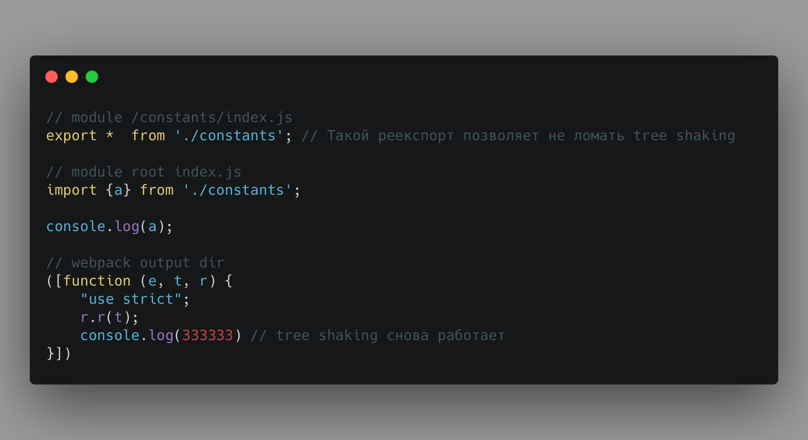

## Что такое Tree Shaking?

В большинстве фронтовых проектов используют [Webpack](https://webpack.js.org/) как сборщик и вот в нем есть функционал [Tree Shaking](https://webpack.js.org/guides/tree-shaking/).

Что делает Tree Shaking? Если кратко, то уменьшает количество модулей/кода который попадает в итоговый bundle (сборку) вашего проекта.

## Когда Tree Shaking работает правильно

Внутри модуля `index.js` мы выводим в консоль только имя (свойство name) от импортируемого объекта `user`.

Webpack это видит, и в итоговом собранном файле подставляет сразу значение - `console.log("Serhii")`.

## Когда Tree Shaking не работает

В многих проектах можно встретить подход когда внутри какой-то папки используют `index.js` файл для удобного реэкспорта.

Такой подход упрощает дальнейший импорт модуля без лишнее дублирования имени папки.

Однако такой реэкспорт ломает в webpack 4 tree shaking!!!

Давайте посмотрим, что собралось в итоге?

Webpack в итоговый файл собрал не только используемое нами значение `constants.a`, но и потянул весь модуль
целиком. Сейчас это не глобальная проблема, но такой модуль может быть большим по размеру и в настоящем проекте может быть не один.

Как итог лишний код в **production** сборке.

## Как чинить?

1. Использовать другой вариант реэкспорта.

Да он немного отличается, так как нет возможности 
использовать весь модуль как пространство имен, но если вам нужна лишь часть из этого модуля, то ее легко достать.

2. Использовать **Webpack 5**.

В нем [починили этот баг](https://webpack.js.org/blog/2020-10-10-webpack-5-release/#nested-tree-shaking), и он научился обрабатывать вложенные проперти для экспорта.

